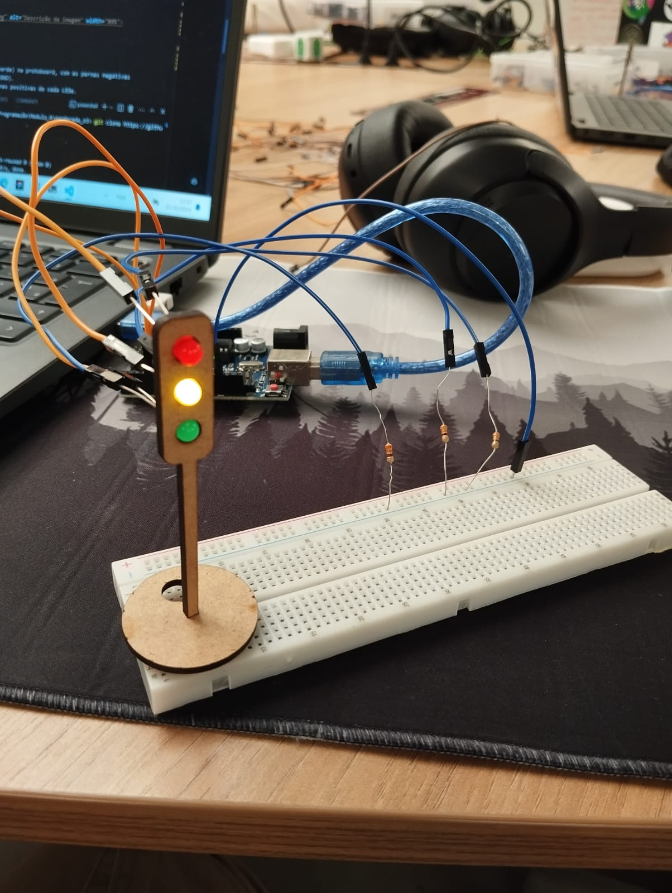

# Ponderada Semana 3 - Thiago Volcati
Turma: 12 

### Montagem

O projeto foi um protótito de um semáforo, utilizando um arduino uno, protoboards e jumpers para auxiliar o desenvolvimento

    

1. Com jumpers macho-fêmea conecte os terminais positivos dos LEDs em portas digitais do Arduino UNO (nesse caso, as portas 4, 5 e 6). 
2. Com jumpers fêmea-fêmea conecte os terminais negativos dos LEDs em resistores 330 Ω.
3. Conecte os jumpers com resistores na terminal GND da protoboard
4. Com um jumper macho-macho conecte o GND do arudino UNO ao terminal GND da protoboard

#### Video Semaforo
Se encontra na pasta "assets" com o nome "demo.mp4"

#### Programação do aparelho
Se encontra na raíz do projeto com o nome "code.cpp"

### Tabela de Bill of Materials

| Quantidade | Descrição               | Especificações     |
|------------|--------------------------|---------------------|
| 1          | LED Vermelho             | -                  |
| 1          | LED Verde                | -                  |
| 1          | LED Amarelo              | -                  |
| 3          | Jumpers                  | (Macho x Macho)    |
| 3          | Jumpers                  | (Fêmea x Fêmea)    |
| 1          | Jumpers                  | (Macho x Fêmea)    |
| 3          | Resistores               | 330 Ω              |
| 1          | Protoboard               | -                  |
| 1          | Arduino Uno              | -                  |
| 1          | Cabo de Alimentação      | -                  |

### Tabela de Avaliação entre Pares (Avaliação Recebida)

#### Avaliador: Marlos Guedes

|Critério|	Contempla (Pontos)|	Contempla Parcialmente (Pontos)	|Não Contempla (Pontos)	|Observações do Avaliador|
|-|-|-|-|-|
|Montagem física com cores corretas, boa disposição dos fios e uso adequado de resistores	|Até 3	|Até 1,5	|0 | 3 - Atende perfeitamente|	
|Temporização adequada conforme tempos medidos com auxílio de algum instrumento externo	|Até 3	|Até 1,5	|0 | 3 - Atende perfeitamente|	
|Código implementa corretamente as fases do semáforo e estrutura do código (variáveis representativas e comentários) |	Até 3|	Até 1,5 |	0 | 3 - Atende perfeitamente|	
|Ir além: Implementou um componente de extra, fez com millis() ao invés do delay() e/ou usou ponteiros no código |	Até 1 |	Até 0,5 |	0 | 3 - Atende perfeitamente|	
| | | | |Pontuação Total: 10|

### Tabela de Avaliação entre Pares (Avaliado)

#### Avaliado: Marlos Guedes

|Critério|	Contempla (Pontos)|	Contempla Parcialmente (Pontos)	|Não Contempla (Pontos)	|Observações do Avaliador|
|-|-|-|-|-|
|Montagem física com cores corretas, boa disposição dos fios e uso adequado de resistores	|Até 3	|Até 1,5	|0 | 3 - Atende perfeitamente|	
|Temporização adequada conforme tempos medidos com auxílio de algum instrumento externo	|Até 3	|Até 1,5	|0 | 3 - Atende perfeitamente|	
|Código implementa corretamente as fases do semáforo e estrutura do código (variáveis representativas e comentários) |	Até 3|	Até 1,5 |	0 | 3 - Atende perfeitamente|	
|Ir além: Implementou um componente de extra, fez com millis() ao invés do delay() e/ou usou ponteiros no código |	Até 1 |	Até 0,5 |	0 | 3 - Atende perfeitamente|	
| | | | |Pontuação Total: 10|
